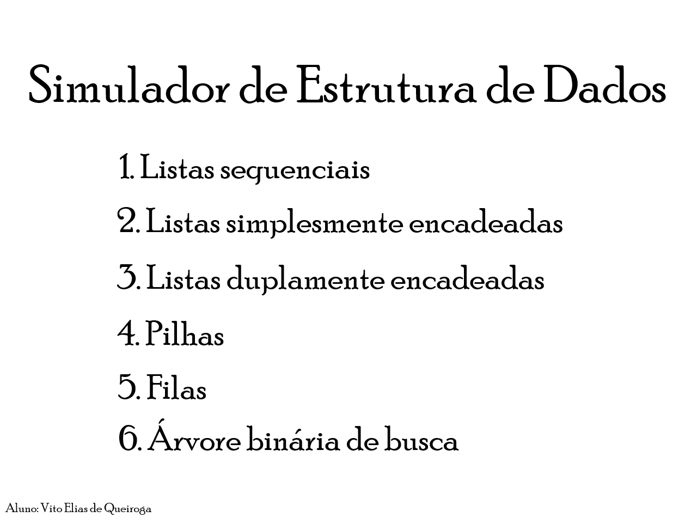
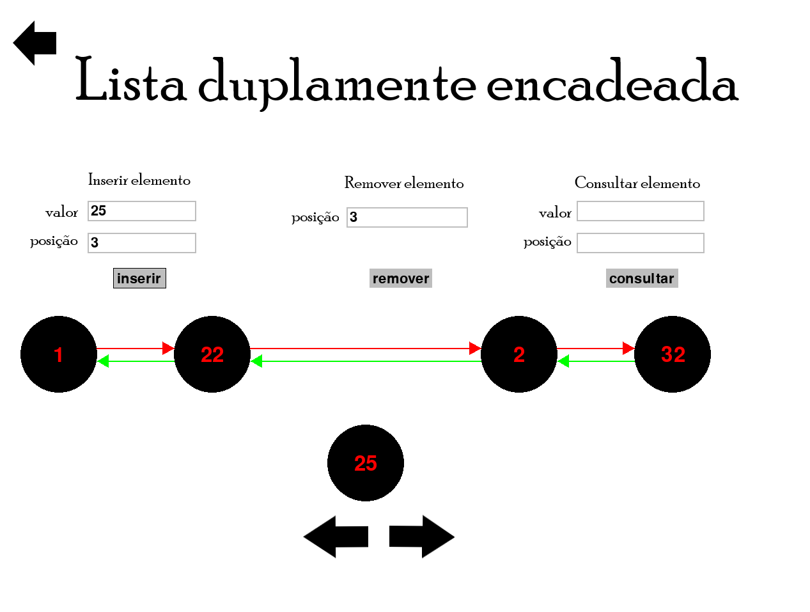

# Projeto 1 Estrutura de Dados

### Este projeto tem como objetivo ilustrar de forma visual o funcionamento de algumas estruturas de dados, tais como:
- Listas sequenciais
- Listas simplesmente encadeadas
- Listas duplamente encadeadas

## Requirements:

- Python version 3.10.11
- PyGame version 2.3.0

Você pode instalar a biblioteca PyGame utilizando o comando "pip install pygame" no seu terminal python.

## Como rodar o programa

Após baixar os arquivos, tenha o cuidado de manter as imagens no mesmo diretório do código, caso contrário, o programa não irá encontrá-las. Verifique 
também se código está sendo rodado no diretório correto. 

## Utilização

O programa possui uma interface simples e deve-se utilizar um mouse e um teclado.

 
  
  

